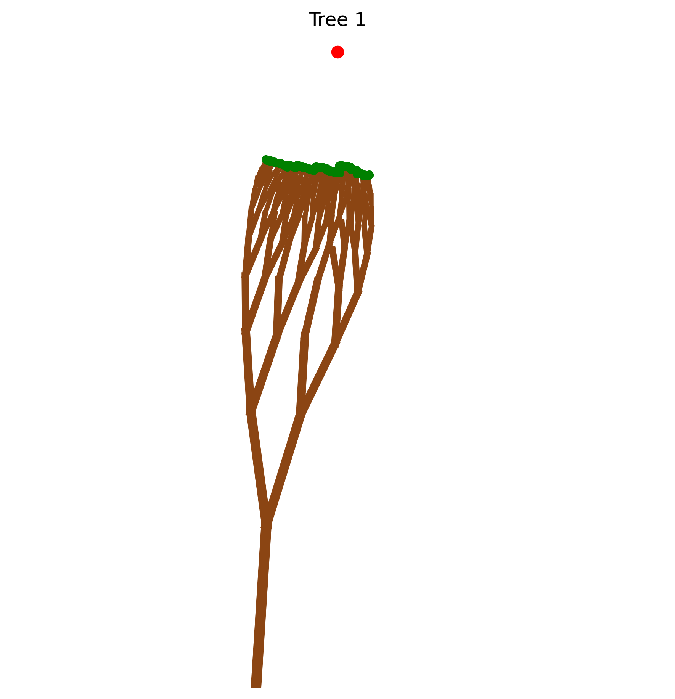
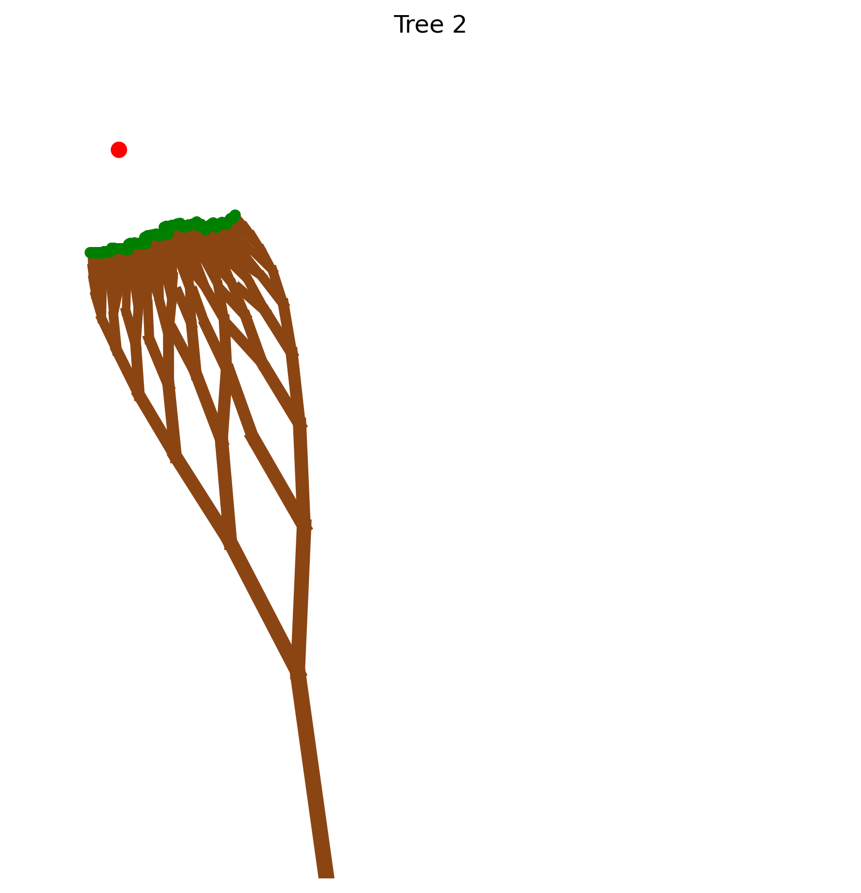
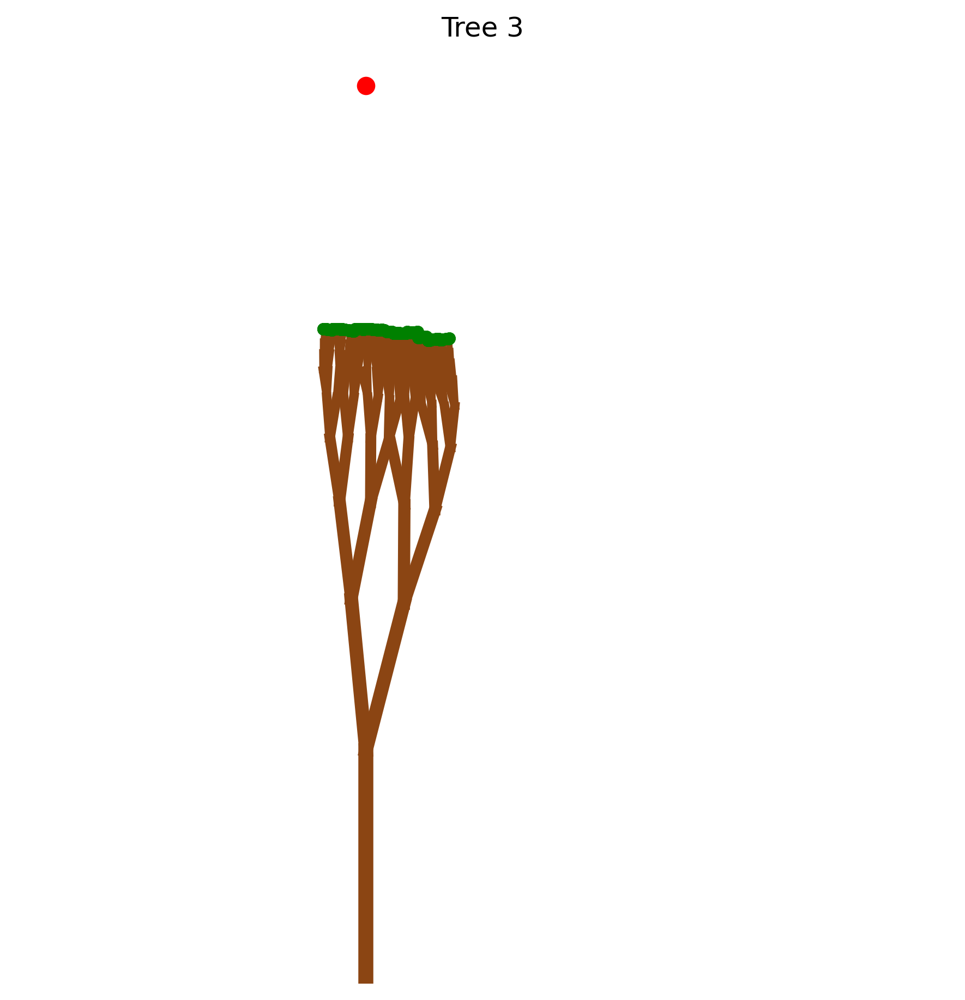
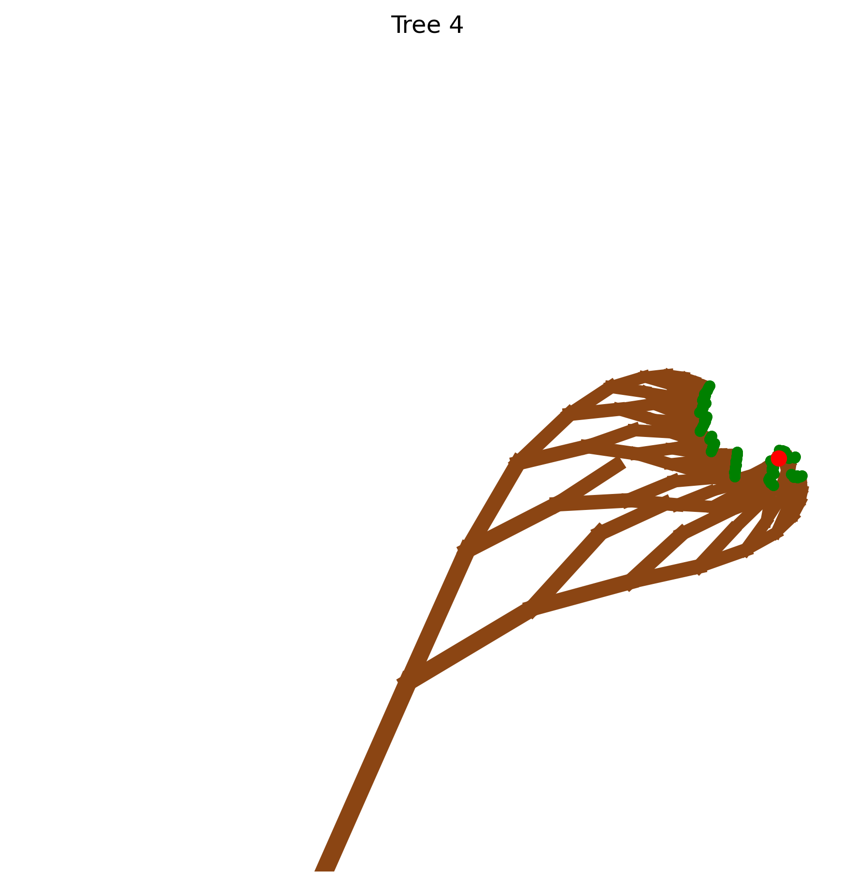

# Assignment 2: Exploring Fractals through Recursive Geometric Patterns

[View on GitHub]({{ site.github.repository_url }})


## Objective

In this assignment you will implement a **recursive generator** and enrich it with **geometric influences** that shape how the structure grows in space. You will work with geometric primitives (lines, polylines) using **Shapely** and render the results (e.g., with Matplotlib). The core of the assignment is to **couple formal grammar growth with spatial rules** such as attractor/repulsor points, fields, and collision constraints to produce expressive, controllable patterns.

While the branching or growth approach can be inspired by L-systems, it does not have to be strictly L-system based. You are encouraged to explore recursive generation methods influenced by spatial constraints and geometric rules that govern how the fractal develops and interacts with its environment. This opens opportunities to experiment with recursive branching logic, adaptive scaling, and spatial modulation beyond formal grammar rewriting.

---

## Repository structure

```
A2/
├── index.md                    
├── README.md                   
├── BRIEF.md                    
├── fractal_generator.py        
└── images/                     
    ├── branching.png           
    └── Tree_1.png
    ├── Tree_2.png
    ├── Tree_3.png
    └── Tree_4.png
```
---

---

# Table of Contents

- Pseudo-Code
- Technical Explanation
- Geometric Influences
- Parameters & Seeds
- Appearance Mapping
- Experiments
- Challenges and Solutions
- References

---

# Pseudo-Code

The core idea is to generate a natural-looking tree through recursion. Each branch splits into two smaller branches, with curvature influenced by an attractor point and random deviations for realism. The recursion terminates either when the branch is too small (`min_length`) or when the maximum depth is reached.

**Steps:**

1. **draw_branch(ax, x, y, length, angle, depth, ...)**  
   - Calculate the angle toward the attractor and blend it with the current branch angle.  
   - Compute the endpoint `(x2, y2)` using trigonometry.  
   - Check for collisions with existing branches and halt growth if there’s an intersection.  
   - Save the line and depth for plotting and future collision checks.  
   - Introduce a small random angle deviation for natural asymmetry.  
   - Reduce branch length by `shrink_factor` and adjust divergence with `branch_angle`.  
   - Recursively call `draw_branch` twice for the left and right child branches.

2. **draw_tree(title, ...)**  
   - Set up the Matplotlib plot with fixed axis limits for comparability.  
   - Draw the attractor as a red dot.  
   - Call `draw_branch` to recursively build the tree.  
   - Plot all branches, scaling line thickness by depth to simulate trunk tapering.  
   - Save the resulting image in `images/` with a descriptive filename.  

3. **Repeat with different seeds and parameters**  
   - Produces four distinct trees with reproducible results.

---

# Technical Explanation

The fractal trees are generated using a recursive branching process, producing self-similar, tree-like structures. Each branch begins at a point `(x, y)` and extends to `(x2, y2)` using basic trigonometry: `x2 = x + length * cos(angle)` and `y2 = y + length * sin(angle)`. Recursion stops when branches are smaller than `min_length` or the maximum depth is reached.

A key feature is the **attractor**, a point that bends branches toward itself. Its effect is controlled by `attractor_strength`. Values closer to 1 make branches curve more strongly toward the attractor, while values near 0 produce straighter growth. Random deviations of ±10° are added to mimic natural asymmetry.

Branch lengths scale with each recursion using `shrink_factor`, controlling overall tree height. Branch divergence is determined by `branch_angle`, which diminishes with depth so higher branches stay closer together. Collision avoidance ensures no branch crosses another, preserving clean visual structure.

These parameters quantitatively affect tree geometry. The total tree height roughly follows `initial_length × shrink_factor^max_depth`. Larger `branch_angle` spreads branches wider, and higher `attractor_strength` increases curvature toward the attractor. Randomness introduces subtle, reproducible variations, allowing diverse yet controlled tree shapes.

---

# Geometric Influences

1. **Attractor**  
   Pulls branches toward a fixed point, simulating effects like sunlight or environmental constraints.

2. **Self-Avoidance**  
   Each new branch checks for intersections with previous branches using Shapely. This prevents overlap and ensures visual clarity.

3. **Adaptive Branching**  
   Branch angles and lengths scale with depth, creating narrower, shorter branches near the top and wider, thicker branches at the base, emulating real tree growth patterns.

---

# Parameters & Seeds

| Figure | Start    | Depth | Angle Δ| Length | Scale | Influences          | Seed | Notes                |
|--------|----------|-------|--------|--------|-------|--------------------|------|--------------------|
| 1      | (0,-200) | 10    | 25°    | 100    | 0.7   | attractor=(50,190)  | 42   | Default example     |
| 2      | (0,-200) | 12    | 30°    | 100    | 0.7   | attractor=(-100,150)| 99   | Leaning left        |
| 3      | (0,-200) | 10    | 20°    | 100    | 0.65  | attractor=(0,185)   | 123  | Smaller, thinner    |
| 4      | (0,-200) | 14    | 35°    | 100    | 0.7   | attractor=(220,0)   | 2024 | Branches circle     |

---

# Appearance Mapping

- **Line thickness:** decreases with depth to simulate tapering.  
- **Branch color:** 'saddlebrown'.  
- **Leaves:** green dots at branch tips.  
- **Attractor:** red dot for reference.

---

# Experiments & Observations

- Tree 1: leans slightly right.  
- Tree 2: leans left.  
- Tree 3: smaller and thinner due to lower `shrink_factor`.  
- Tree 4: attractor close to leaves makes branches curve.  

Observations:  
- Small seed changes produce realistic variation.  
- Higher `branch_angle` spreads branches, stronger `attractor_strength` curves them more.  
- Shrink factor controls overall size.  
- Collision checks prevent overlapping branches, keeping shapes clean.

---

# Challenges & Solutions

1. **Overlapping branches:** solved with Shapely intersection checks.  
2. **Natural asymmetry:** solved with ±10° random angle deviations.  
3. **Recursion control:** stop recursion if branch < `min_length` or max depth reached.  
4. **Reproducibility:** achieved using `random.seed(seed)`.

---

# Results

Tree outputs are saved in `images/` and embedded below with parameters for clarity:

**Tree 1:**  
  
Parameters: Depth=10, Branch Angle=25°, Shrink Factor=0.7, Attractor=(50,190), Seed=42  

**Tree 2:**  
  
Parameters: Depth=12, Branch Angle=30°, Shrink Factor=0.7, Attractor=(-100,150), Seed=99  

**Tree 3:**  
  
Parameters: Depth=10, Branch Angle=20°, Shrink Factor=0.65, Attractor=(0,185), Seed=123  

**Tree 4:**  
  
Parameters: Depth=14, Branch Angle=35°, Shrink Factor=0.7, Attractor=(220,0), Seed=2024  

---

# References

- Shapely Manual: https://shapely.readthedocs.io/en/stable/manual.html  
- Matplotlib Pyplot Tutorial: https://matplotlib.org/stable/tutorials/introductory/pyplot.html  
- Recursion explanation: https://en.wikipedia.org/wiki/Recursion_(computer_science)  
- Trigonometry basics: https://en.wikipedia.org/wiki/Trigonometry  
"""
